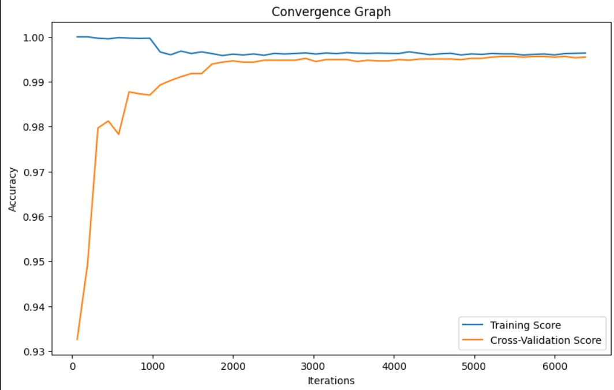

# Parameter Optimization for SVM

## About SVM and Parameter Optimization
Support Vector Machine or SVM is one of the most popular Supervised Learning algorithms, which is used for Classification as well as Regression problems. However, primarily, it is used for Classification problems in Machine Learning.

Some of the most important parameters of SVM such as kernel, C, and gamma can be changed in order to achieve a higher accuracy. This is called as Hyperparameter Tuning.

We can perform this task using GridSearchCV for optimizing these parameters.

Here, Fitness Function has been used to optimize the parameters.

## Dataset Description

The dataset used for this analysis is the "Room Occupancy Estimation" dataset obtained from the UCI Machine Learning Repository. This dataset is designed for estimating the precise number of occupants in a room using multiple non-intrusive environmental sensors.

- **Dataset Link:** [Room Occupancy Estimation Dataset](https://archive.ics.uci.edu/dataset/864/room+occupancy+estimation)
- **Number of Instances:** 10129
- **Number of Attributes:** 18

## Parameter Optimization

For parameter optimization, the dataset was split into 10 different samples with a 70-30 training-testing split. SVM was optimized for each sample with 100 iterations. The parameters optimized include kernel, C, and gamma.

Here are the results of parameter optimization:

| Sample | Best Accuracy | Best Kernel | Best C | Best Gamma |
|--------|---------------|-------------|--------|------------|
|   1    |     0.98      |    Poly     |  2.98  |    8.69    |
|   2    |     1.00      |    Linear   |  2.32  |    5.06    |
|   3    |     1.00      |    Linear   |  1.39  |    0.21    |
|   4    |     1.00      |    Linear   |  1.11  |    3.98    |
|   5    |     1.00      |    Linear   |  0.56  |    1.67    |
|   6    |     0.99      |    Linear   |  9.74  |    5.66    |
|   7    |     0.99      |    Linear   |  2.12  |    4.44    |
|   8    |     1.00      |    Linear   |  1.10  |    9.56    |
|   9    |     0.99      |    Poly     |  5.87  |    8.07    |
|   10   |     0.99      |    Poly     |  3.80  |    6.57    |

## Convergence Graph

From the convergence graph,  we can conclude that the model is well trained and parameter have been optimized due to the less gap between training and cross-validation curve as the number of iterations increases.

